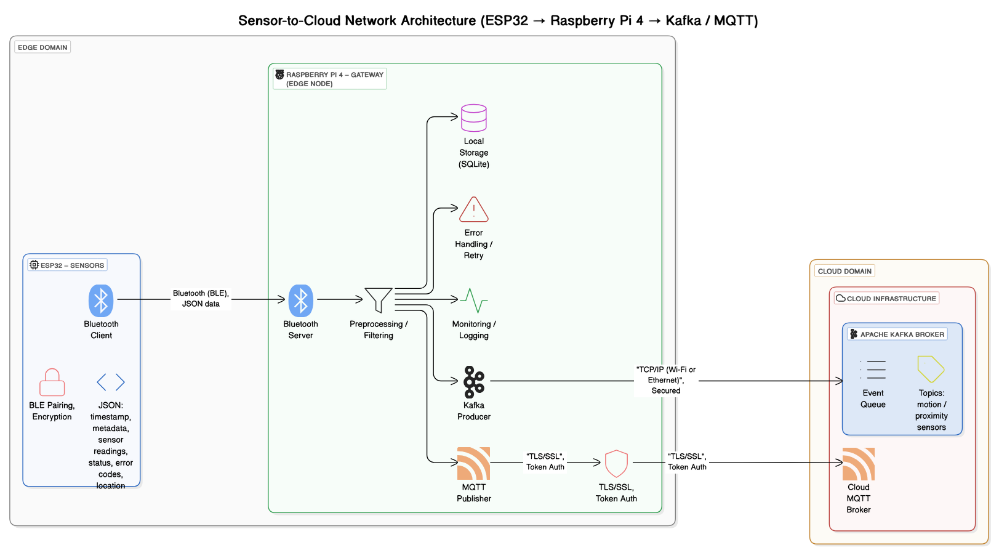

# BLE Kafka Gateway

Este projeto implementa um servidor GATT BLE em Python e Go que atua como gateway entre dispositivos IoT (como ESP32) e um broker Apache Kafka. O objetivo é criar uma solução para transmissão de dados sensoriais usando Bluetooth Low Energy (BLE) e envio desses dados para a nuvem via Kafka, com suporte a autenticação JWT.

## 📌 Visão Geral

Este servidor BLE roda no Raspberry Pi 4 e expõe uma characteristic BLE que aceita dados no formato JSON contendo um token JWT. Ao receber os dados, o servidor:

1. Valida o token JWT.
2. Verifica a expiração do token.
3. Encaminha os dados para um tópico Kafka.

O projeto tem como objetivo principal reduzir o consumo de energia em dispositivos IoT, substituindo a comunicação baseada em Wi-Fi por uma solução mais eficiente utilizando Bluetooth Low Energy (BLE), mantendo a confiabilidade na transmissão de dados através da integração com Apache Kafka.

## 🧱 Componentes

- **ESP32**: Atua como cliente BLE, envia dados com JWT.
- **Raspberry Pi 4**: Atua como servidor BLE, validando dados e produzindo mensagens para o Kafka.
- **Apache Kafka**: Broker de mensagens na nuvem que recebe dados sensoriais.
- **JWT**: Utilizado para autenticação dos dados enviados.

## 📂 Estrutura do Projeto

```bash
.
├── README.md                  # Documentação principal do projeto
├── ble_go_server              # Implementação do servidor BLE em Go
│   ├── cmd/
│   │   └── main.go            # Ponto de entrada do servidor Go
│   ├── configs/
│   │   └── settings.go        # Configurações do servidor Go
│   ├── services/
│   │   ├── bluetooth.go       # Serviço BLE (GATT) no Go
│   │   └── kafka.go           # Integração Kafka no servidor Go
│   ├── go.mod                 # Gerenciamento de dependências Go
│   ├── README.md              # Documentação
│   └── install-dependencies.sh  # Script para instalar dependências Go
├── ble_ino_client             # Código para o cliente BLE no ESP32/Arduino
│   └── ble_client.ino         # Implementação do cliente
│   ├── README.md              # Documentação
└── ble_py_server              # Implementação do servidor BLE em Python
    ├── main.py                # Ponto de entrada do servidor Python
    ├── services/
    │   ├── bluetooth.py       # Serviço BLE (GATT) no Python
    │   └── kafka.py           # Integração Kafka no servidor Python
    ├── configs/
    │   ├── settings.py        # Configurações no servidor Python
    │   └── __init__.py
    ├── requirements.txt       # Dependências Python do projeto
    ├── README.md              # Documentação
    └── install-dependencies.sh  # Script para instalar dependências Python
```

## 📡 Funcionalidades

- **BLE Advertising**: Dispositivo se anuncia como periférico com UUID de serviço customizado.
- **GATT Service/Characteristic**: Expõe characteristic com suporte a `WriteValue`.
- **Autenticação JWT**: Validação do campo `jwt` presente no payload.
- **Produtor Kafka**: Envia os dados JSON para o broker Kafka no tópico `sensor.data`.

## 📡 Arquitetura Sensor-to-Cloud (ESP32 → Raspberry Pi 4 → Kafka / MQTT)

Abaixo está a representação da arquitetura do servidor BLE:



### 🔹 1. Edge Domain

#### ✅ ESP32 — SENSORS (Client BLE)

- Atua como cliente BLE, enviando dados no formato JSON.
- Utiliza emparelhamento BLE e criptografia para segurança.
- Dados enviados incluem: timestamp, leituras de sensores, metadados, localização, status e códigos de erro.

#### ✅ Raspberry Pi 4 — GATEWAY (Servidor BLE)

- Atua como servidor BLE, recebendo dados JSON do ESP32.
- Executa:
  - **Preprocessamento e filtragem**
  - **Armazenamento local** (SQLite)
  - **Tratamento de erros e retry**
  - **Monitoramento / logging**
  - **Envio para Kafka** (modo padrão)
  - **Publicação MQTT** (modo alternativo)

---

### 🔹 2. Cloud Domain

#### ✅ Apache Kafka Broker

- Recebe eventos do Raspberry Pi via TCP/IP seguro.
- Organiza os dados em tópicos (ex: `motion`, `proximity`).
- Ideal para pipelines de analytics.

#### ✅ Cloud MQTT Broker

- Alternativa leve ao Kafka.
- Útil para integração com sistemas móveis ou IoT legados.
- Comunicação via **TLS/SSL** e autenticação por token.

---

### 🔐 Segurança

- BLE com emparelhamento + criptografia.
- Transmissão para a nuvem via TLS/SSL.
- Autenticação por token (JWT) para publicação Kafka/MQTT.

---

### 🌐 Tecnologias utilizadas

- Bluetooth Low Energy (BLE, GATT Profile)
- Raspberry Pi 4 + BlueZ + D-Bus
- Apache Kafka + Segmentio Kafka Go Client
- SQLite (fallback de persistência local)
- MQTT (em modo seguro)

## 🛠️ Próximos Passos

- [ ] Adicionar reconexão automática com o Kafka.
- [ ] Melhorar logs e tratamento de erro.
- [ ] Persistência local em caso de falha de rede.
- [ ] Suporte a múltiplos characteristics e serviços.

## 🧾 Licença

MIT License

Copyright (c) 2025 Elinilson Vital

Permission is hereby granted, free of charge, to any person obtaining a copy
of this software and associated documentation files (the "Software"), to deal
in the Software without restriction, including without limitation the rights
to use, copy, modify, merge, publish, distribute, sublicense, and/or sell
copies of the Software, and to permit persons to whom the Software is
furnished to do so, subject to the following conditions:

The above copyright notice and this permission notice shall be included in all
copies or substantial portions of the Software.

THE SOFTWARE IS PROVIDED "AS IS", WITHOUT WARRANTY OF ANY KIND, EXPRESS OR
IMPLIED, INCLUDING BUT NOT LIMITED TO THE WARRANTIES OF MERCHANTABILITY,
FITNESS FOR A PARTICULAR PURPOSE AND NONINFRINGEMENT. IN NO EVENT SHALL THE
AUTHORS OR COPYRIGHT HOLDERS BE LIABLE FOR ANY CLAIM, DAMAGES OR OTHER
LIABILITY, WHETHER IN AN ACTION OF CONTRACT, TORT OR OTHERWISE, ARISING FROM,
OUT OF OR IN CONNECTION WITH THE SOFTWARE OR THE USE OR OTHER DEALINGS IN THE
SOFTWARE.

> Os códigos e documentos deste projeto foram desenvolvidos em colaboração com ferramentas de Inteligência Artificial, como ChatGPT e GetBrain IA Assistant, ao longo de ciclos iterativos de desenvolvimento, testes e refinamentos.
